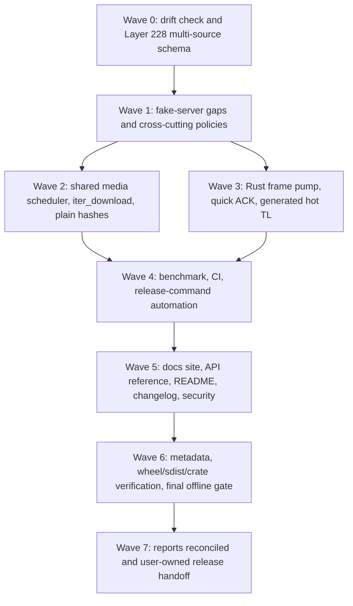

# miniproto v0.1.0 Alpha Completion Plan

Date: 2026-08-12  
Status: In progress; Waves 0 through 4 implementation completed on 2026-08-13 and stabilized locally on 2026-08-14 after the supplied hosted CI failure. TASK-082 now includes a real CPython 3.14t source/native gate and dispatch-only multi-architecture wheel automation; 3.13t was removed to keep current PyO3. The task still needs a corrected hosted CI rerun, a manual wheel workflow run, and the strict docs CI lane waiting for Wave 5.
Planning baseline commit: `8ee916cb77df69ef6cd0358906bb27ae706051e4`  
Wave 0 execution baseline commit: `41fff4e5feeb3ba2700155798a9ea9646682b0d3`  
Scope: Telegram schema refresh, remaining protocol/performance work, Phase 12 verification and automation, Phase 13 documentation/packaging/release preparation, and reconciliation of the authoritative plans/progress reports.  
Git boundary: repository agents use read-only Git only. The user owns branches, staging, commits, tags, publishing, releases, and pushes. TASK-094 ends at a verified, documented, tag-ready handoff.

## 1. Objective And Definition Of Done

Deliver a coherent `0.1.0` package classified as Alpha whose generated API follows the newest selected Telegram schema sources, whose requested protocol and performance features are implemented with native/fallback parity, whose deterministic offline release suite passes, whose platform wheels and sdist clean-install correctly, and whose searchable Markdown documentation can be deployed to GitHub Pages or any static host.  
The work is complete only when all mandatory offline gates in Section 12 pass, requested task/report statuses are reconciled against fresh evidence, and every incomplete live-only gate is explicitly separated from offline completion. A real Telegram benchmark result is evidence about a particular account/DC/network/run; it is not a substitute for deterministic correctness tests, and external variance or missing credentials does not falsify an otherwise passing offline release gate.

## 2. Confirmed Decisions

| Decision                       | Selected policy                                                                                                                                                 | Consequence                                                                                                                                                                                                                                                            |
| ------------------------------ | --------------------------------------------------------------------------------------------------------------------------------------------------------------- | ---------------------------------------------------------------------------------------------------------------------------------------------------------------------------------------------------------------------------------------------------------------------- |
| Canonical TL source            | TDLib `master`                                                                                                                                                  | Generated public TL code includes TDLib-specific bootstrap/legacy constructors. Telegram Desktop supplies the inherited layer only after overlap consistency checks.                                                                                                   |
| Layer source                   | Telegram Desktop end-of-file `// LAYER N` marker                                                                                                                | The current selected snapshot is Layer 228. A missing/invalid marker or contradictory overlap is a STOP condition.                                                                                                                                                     |
| Other schema sources           | Pin Telegram Desktop, core JSON, core TL mirror, core RPC errors, and layer changelog                                                                           | All sources remain independently hashed and diffable; stale core sources do not silently override TDLib.                                                                                                                                                               |
| Documentation site             | Astro Starlight                                                                                                                                                 | Markdown-first, statically prerendered site with project-owned visual design, component overrides, GitHub Pages deployment, CI artifact, and documented portable/VPS build commands.                                                                                   |
| Search                         | Starlight's integrated Pagefind pipeline plus a project-owned search UI override where filtering requires it                                                    | Fully static/self-hosted chunked search over handwritten and generated pages; no hosted search service, account, database, or runtime server.                                                                                                                          |
| Python API extraction          | Griffe plus `griffe2md` plus a thin miniproto adapter                                                                                                           | Static source inspection produces complete committed Markdown rather than import-time rendering directives; the adapter owns symbol selection, page granularity, frontmatter, routes, source links, and category manifests without reimplementing Griffe's parser.     |
| Rust API extraction            | Pinned nightly rustdoc JSON plus pinned `cargo-docs-md`                                                                                                         | Compiler-accurate per-module Markdown; docs-only nightly does not replace the stable Rust 1.97 build toolchain.                                                                                                                                                        |
| Telegram API extraction        | In-house generator over the normalized canonical schema/error model                                                                                             | Telegram functions, types, constructors, errors, relationships, layer/source information, indexes, and Markdown routes remain schema-authoritative and are not inferred from Python bindings or scraped HTML.                                                          |
| Documented symbol scope        | Exported Python APIs, all Telegram raw types/functions/errors, and public/PyO3 Rust items                                                                       | Private helpers remain available through source links but are not part of the reference contract.                                                                                                                                                                      |
| Documentation content boundary | Existing `docs/*.md` files remain canonical handwritten project documents and generated reference pages live under `docs/reference/**`                          | The existing seven Markdown documents are never overwritten by generators or counted as generated API output. Publicly useful documents can be routed into the site; `docs/THOUGHTS.md` remains internal and is excluded from content loading, navigation, and search. |
| Generated Markdown storage     | Commit every deterministic Python/Rust/Telegram reference page and generated category/index page                                                                | Generated documentation is reviewable, linkable, and available without running an extractor. CI regenerates into an isolated temporary tree and fails on any byte-level drift, missing page, stale page, or uncommitted output.                                        |
| Generated build artifacts      | Ignore dependency caches, temporary rustdoc JSON/adapter intermediates, Astro caches, `docs-site/dist/`, Pagefind indexes, and generated JavaScript/CSS bundles | Ignore output directories precisely; never add a repository-wide `*.js` rule because JavaScript/TypeScript/Astro source and configuration remain committed.                                                                                                            |
| Brand identity                 | Four materially distinct logo concepts followed by an explicit user selection/refinement checkpoint                                                             | Each concept has a real editable SVG counterpart; the selected identity then receives light/dark/monochrome marks, wordmark lockups, favicon, and social-preview derivatives before the final theme is accepted.                                                       |
| String sessions                | Native versioned format plus Telethon v1 and Pyrogram current/legacy compatibility                                                                              | Third-party conversions are deliberately lossy and covered by pinned golden fixtures; neither library becomes a runtime dependency.                                                                                                                                    |
| Quick ACK API                  | Per-call opt-in                                                                                                                                                 | Existing awaits remain tied to actual RPC results. An optional callback/event only means Telegram received, decrypted, and queued the encrypted packet.                                                                                                                |
| Live acceptance                | Separate gate                                                                                                                                                   | Offline correctness/build/docs/package gates are mandatory. Linux/Windows live automation is mandatory; execution uses available credentials and records external blockers separately.                                                                                 |
| Documentation hosting          | GitHub Pages plus portable static artifact                                                                                                                      | The same prerendered Astro/Pagefind output can later be copied to another static host or built on a VPS; no Astro, Node, Python, Rust, or search service is required at runtime.                                                                                       |
| Wheel matrix                   | Dispatch-only normal CPython 3.13/3.14 and free-threaded CPython 3.14t wheels on Linux glibc/musl x86_64, aarch64, and armv7l plus native Windows/macOS x86_64 and aarch64; ordinary CI retains sdist and runtime gates but builds no wheels | Thirty wheel lanes install with no dependencies in the target environment, exercise the bundled native layer and protected sessions, run concurrent native calls and every installed CLI `--help`, and prove the GIL is disabled for 3.14t. CPython 3.13t is excluded to keep current PyO3. |
| Execution shape                | Risk-first dependency waves                                                                                                                                     | Final TASK-087/092/093 evidence is collected only after behavior, generated outputs, and documentation settle.                                                                                                                                                         |
| Version/status                 | Exactly `0.1.0`, Development Status Alpha                                                                                                                       | Do not use a PEP 440 `aN` suffix unless the user changes this decision. Python and Rust manifests must agree.                                                                                                                                                          |

## 3. Current Baseline And Gap Classification

### 3.1 Schema baseline

- `tools/schema/update.py` currently fetches core.telegram.org schema JSON, the schema HTML/TL mirror, RPC errors, and the layer page only. It does not fetch Telegram Desktop or TDLib.
- `tools/schema/schema.json`, `tools/schema/schema.tl`, metadata, generated Python facades/shards/stubs, registry, error tables, and `docs/raw-api.md` are currently based on core Layer 223.
- The existing parser accepts constructor-ID declarations and structured comments but needs explicit handling for TDLib built-in/combinator declarations without `#id`, source-specific layer markers, and multi-source provenance.
- The generator currently treats core JSON as canonical and hardcodes core-oriented provenance wording in several outputs.

### 3.2 Downloaded source comparison on 2026-08-12

| Source                      | Layer evidence                          | Recognized ID declarations | Types | Functions | Difference from preceding source                                                                    |
| --------------------------- | --------------------------------------- | -------------------------: | ----: | --------: | --------------------------------------------------------------------------------------------------- |
| Current repository/core pin | Layer 223                               |                      2,303 | 1,546 |       757 | Baseline                                                                                            |
| Telegram Desktop `dev`      | End comment `// LAYER 228`              |                      2,449 | 1,643 |       806 | 146 additions, no removals, 56 changed overlapping signatures versus the current pin                |
| TDLib `master`              | No independent end-of-file layer marker |                      2,460 | 1,649 |       811 | 12 additions, one removal (`null`), and zero changed overlapping signatures versus Telegram Desktop |

TDLib-only declarations observed in this snapshot include bootstrap/transport wrappers and legacy compatibility constructs such as `invokeWithReCaptchaPrefix`, `invokeWithGooglePlayIntegrityPrefix`, `invokeWithApnsSecretPrefix`, `inputPeerPhotoFileLocationLegacy`, and `inputStickerSetThumbLegacy`. The user explicitly selected this larger source as canonical, so their presence is intentional. The disappearance of generated `Null` is an expected raw-API breaking change and must be documented, tested, and reviewed like every constructor removal.

### 3.3 Requested implementation status before this plan

| Area                             | Current extent                                                                                                                                                       | Missing work this plan must close                                                                                                                                                                    |
| -------------------------------- | -------------------------------------------------------------------------------------------------------------------------------------------------------------------- | ---------------------------------------------------------------------------------------------------------------------------------------------------------------------------------------------------- |
| TASK-082 CI                      | Ruff, ty, generated-schema check, pytest, Rust fmt/Clippy/tests exist; Python CI currently targets only 3.14.                                                        | Explicit 3.13/3.14 matrix, docs build, wheel/sdist matrix and clean imports, benchmark smoke artifact, scheduled upstream-schema check.                                                              |
| TASK-084 fake server             | Strong component and encrypted fake-transport tests cover reconnects, retries, update gaps, media paths, DC migration, state/service messages, and transport errors. | A small set of end-to-end auth/raw/transfer/migration/reset journeys using the shared fake server, plus new quick-ACK/hash/scheduler cases.                                                          |
| TASK-085 benchmarks              | Native/fallback crypto, TL primitives, imports, 1k pending RPCs, update dispatch, opt-in live media, counters, and RSS snapshots exist.                              | Frame-pump/hot-constructor cases, cross-transfer fairness, deterministic reconnect and sustained RSS soak, tglib mode, matrix runner, loop-lag probe, Windows automation, normalized JSON/artifacts. |
| TASK-086 release aggregation     | Commands are documented in several sections.                                                                                                                         | One non-secret cross-platform command that runs the canonical ordered suite and emits a machine-readable summary.                                                                                    |
| TASK-087 full local verification | Historical gates exist, including the 2026-07-17 report.                                                                                                             | Fresh final evidence after all work in this plan; historical success is not current proof.                                                                                                           |
| TASK-092 wheel verification      | Existing artifacts/directories exist.                                                                                                                                | Fresh non-editable builds, content inspection, clean imports, matrix artifacts, and paths/hashes. An editable `.pth` wheel is explicitly invalid evidence.                                           |
| TASK-093 metadata                | Names, license, URLs, Python floor, and Rust crate scaffold exist at `0.0.1`/Pre-Alpha. PyPI has the reserved `0.0.1a0` placeholder.                                 | Align `0.1.0`/Alpha, complete package/crate metadata, verify README rendering and sdist/wheel/crate contents.                                                                                        |
| TASK-094 tag                     | Not applicable yet.                                                                                                                                                  | Produce a final release checklist and exact user-owned tag/publish commands; do not tag or publish.                                                                                                  |
| Rust transport frame pump        | Python framing reads each header/payload through `StreamReader`; Rust currently accelerates crypto/TL/MTProto envelope primitives only.                              | Stateful native/fallback frame codec, multi-frame drain, bounded reuse, padded-intermediate correctness, performance evidence.                                                                       |
| Rust hot TL constructors         | Native TL primitives/vector helpers exist.                                                                                                                           | Schema-driven selected constructor encoders/decoders, dispatch, parity, profiling, and generated drift checks.                                                                                       |
| Quick ACK                        | Explicitly documented as deferred.                                                                                                                                   | All supported transport encodings/decodings, token generation/correlation, opt-in callbacks, cleanup, fake/live evidence.                                                                            |
| Method flood cache               | Calls and media parts handle received flood waits.                                                                                                                   | Per-method monotonic deadline cache, pre-send raise/sleep decision, concurrency/expiry bounds, SLOWMODE exclusion, structured metrics.                                                               |
| String sessions                  | Typed session serialization and encrypted SQLite/in-memory storage exist.                                                                                            | Native protected/plain export/import, Telethon v1 and Pyrogram current/legacy compatibility, overwrite/mismatch safety, documentation.                                                               |
| Streaming downloads              | `download_file()`/`download_media()` write or return complete results.                                                                                               | Public ordered `iter_download()` sharing the same engine, cancellation, scheduler, retries, verification, and bounded reordering.                                                                    |
| Plain file hash verification     | CDN verification exists; `upload.getFileHashes` is generated.                                                                                                        | Optional non-CDN hash retrieval, interval coverage, overfetch/trim for partial ranges, verification before yield/write, corruption failure.                                                          |
| Shared scheduler                 | Each download has its own byte window; media pools are shared by kind/DC.                                                                                            | Fair byte-weighted queues shared across simultaneous transfers per DC/direction, active-transfer classification, priority, cancellation, metrics.                                                    |
| Documentation                    | `index`, development, media, session security, raw API, and faked-method pages exist. No site generator exists.                                                      | Requested TASK-088 pages, complete exported docstrings, Python/Rust/Telegram raw generation, search/theme/Pages/artifact/VPS build, README/changelog/security refresh.                               |

## 4. Dependency And Execution Model



Wave 2 and Wave 3 may be developed independently only when they do not overlap shared `client.py`, sender, generator, or benchmark files. In a linear execution, complete Wave 2 before Wave 3 to keep media behavior stable while transport internals change. The schema wave always comes first because Layer 228 constructor IDs/signatures are inputs to tests, native hot-path generation, docs, and release metadata.

## 5. Wave 0 — Drift Check And Multi-Source Layer 228 Schema

### V1-SCHEMA-001 — Revalidate the baseline before edits

Status: Complete on 2026-08-12.  

Files: `PLAN.md`, `PROGRESS.md`, `plans/README.md`, this plan, `tools/schema/**`, generated `src/miniproto/raw/**`, `rust/miniproto/**`, `tests/test_schema_*.py`.  
Steps:

1. Record current `HEAD` and read-only Git status; preserve all user changes and the required `docs/THOUGHTS.md` checkpoint.
2. Re-download the three structural schema sources and core supporting sources into a task-owned temporary directory, recompute SHA-256, declaration counts, layer marker, additions/removals, and changed-overlap report.
3. Compare the fresh results with Section 3.2. If Telegram Desktop and TDLib now disagree on any overlapping declaration, STOP before inheriting the Telegram Desktop layer and present the exact contradictions for user review.
4. Run the existing focused schema tests and deterministic generator check before changing behavior; record pre-change failures separately from implementation regressions.

Acceptance: the implementation starts from current facts, not the 2026-08-12 snapshot if upstream moved.

### V1-SCHEMA-002 — Extend the updater and pin every source independently

Status: Complete on 2026-08-12.  

Primary files: `tools/schema/update.py`, `tools/schema/README.md`, `.env.example`, `tests/test_schema_update.py`.  
Pinned output contract:

- `tools/schema/schema.tl`: verbatim TDLib canonical TL.
- `tools/schema/schema.json`: deterministic normalized canonical model derived from TDLib TL.
- `tools/schema/schema-tdesktop.tl`: verbatim Telegram Desktop TL.
- `tools/schema/schema-core.json`: verbatim core schema JSON.
- `tools/schema/schema-core.tl`: verbatim core schema-page TL mirror or a clearly marked deterministic mirror when the page has no raw block.
- `tools/schema/rpc-errors.json`: verbatim core error source.
- `tools/schema/schema-source-diff.json`: deterministic declaration-level comparison among canonical TDLib, Telegram Desktop, and core.
- `tools/schema/schema-metadata.json`: layer, fetch date, every URL/hash/byte count/declaration count, canonical-source decision, documentation merge precedence, and normalized-output hash.

Steps:

1. Add the exact Telegram Desktop and TDLib raw URLs to the updater allowlist and retry/error handling without weakening host validation.
2. Parse the Telegram Desktop layer only from a strict end-of-file `// LAYER <positive integer>` marker. Do not guess a layer from core or file history.
3. Make the snapshot operation atomic: fetch/parse/validate all sources in memory, write no pin if a required source fails, overlaps contradict, constructor IDs collide, or normalized generation fails.
4. Preserve `--check-upstream`; make it report source-specific drift and exit non-zero without modifying files.
5. Keep deterministic offline pin validation distinct from network freshness. Pull requests use offline checks; a scheduled/manual workflow performs upstream checks.

Acceptance: every input can be audited independently; a partial network response cannot leave a mixed-layer pin.

### V1-SCHEMA-003 — Make the parser source-complete and strict

Status: Complete on 2026-08-12.  

Primary files: `tools/schema/parser.py`, `tests/test_schema_parser.py`, new small fixtures under `tests/fixtures/schema/`.  
Steps:

1. Recognize TDLib built-in/combinator declarations without constructor IDs and classify/ignore only a documented known set rather than silently dropping arbitrary syntax.
2. Preserve namespaces, constructor IDs, flags, generics, vectors, optional parameters, result types, and structured comments from TDLib/Telegram Desktop.
3. Expose one normalized declaration model used by JSON generation, source diffs, Python generation, raw docs, and later Rust hot-path generation.
4. Reject duplicate names, duplicate constructor IDs with incompatible declarations, malformed comments that would attach to the wrong item, and unknown non-empty declaration syntax.
5. Add fixtures for TDLib-only wrappers, the missing `null`, changed Layer 228 signatures, built-ins, end markers, and malformed overlaps.

Acceptance: the full TDLib pin parses to the expected fresh declaration set and every skipped line is a known non-generated primitive/combinator with a test.

### V1-SCHEMA-004 — Define structural and documentation merge rules

Status: Complete on 2026-08-12.  

Primary files: `tools/schema/update.py`, `tools/schema/generate.py`, `tools/schema/schema-metadata.json`, `tools/schema/schema-source-diff.json`.  
Rules:

- Constructor/function structure, IDs, flags, parameters, and results come only from TDLib.
- Layer comes only from the validated Telegram Desktop marker after all overlapping TDLib/Telegram Desktop declarations match.
- Descriptions merge by qualified name and parameter name with precedence TDLib comments, then Telegram Desktop comments, then core JSON descriptions. A supporting source may enrich prose but never alter TDLib structure.
- RPC error definitions/method mappings continue to come from the pinned core error database and are tagged with their independent provenance/date.
- Core drift is reported, not treated as structural authority.

Acceptance: metadata and generated headers state these rules unambiguously; no output still claims core JSON is canonical.

### V1-SCHEMA-005 — Regenerate every schema-derived output and repair Layer 228 behavior

Status: Complete on 2026-08-12.  

Primary files: `tools/schema/generate.py`, `src/miniproto/raw/**`, `src/miniproto/errors.py`, `docs/raw-api.md`, schema tests, codec/invoke/message/media tests affected by changed signatures.  
Steps:

1. Generate normalized JSON, raw facades/shards/stubs, registry, error metadata, summary docs, and source-diff report from the selected pins.
2. Make generation deterministic across Windows/Linux path and newline behavior.
3. Review every removed/renamed/changed generated symbol. Explicitly document `Null` removal and Layer 228 field/ID changes; update handwritten code only where it actually constructs or inspects affected raw objects.
4. Add tests for representative TDLib-only constructors and changed Layer 228 methods, full declaration/registry coverage, import laziness, and stale-output detection.
5. Run the focused schema/generator/codec/invoke tests, then the usual Python/Rust suite. Fix behavior rather than weakening checks.

Acceptance: `uv run miniproto-schema-generate --check` is clean; generated metadata says Layer 228/TDLib canonical; all requested new pins are committed outputs; the full offline baseline passes before feature work continues.

### V1-SCHEMA-006 — Add upstream freshness automation

Status: Complete on 2026-08-12.  

Primary files: `.github/workflows/schema-upstream.yml` or a clearly separated job in `.github/workflows/ci.yml`, `docs/development.md`.  
Steps:

1. Add scheduled and manual `--check-upstream` execution that reports which source moved and uploads the comparison report.
2. Keep pull-request CI deterministic and offline with pin/hash/generated-output checks.
3. Document the exact update command, review sequence, and why the newest fetched file must not be accepted without overlap/layer validation.

Acceptance: upstream movement is visible quickly without making normal CI depend on Telegram/GitHub availability.

### Wave 0 completion evidence

- Fresh sources validated on 2026-08-12: TDLib 1,649 constructors/811 functions, Telegram Desktop 1,643 constructors/806 functions with strict Layer 228 marker, 2,448 shared declarations with zero structural differences, 12 TDLib-only declarations, and Desktop-only `null`.
- Core drift remains supporting evidence only: 68 changed, 158 TDLib-only, and one core-only declaration in `tools/schema/schema-source-diff.json`.
- `uv run python -m tools.schema.update --check-upstream --report .tmp/wave0-schema-upstream-final.json` passed after normalizing only core.telegram.org's volatile trailing page-generation timing comment for source hashing.
- `uv run python -m tools.schema.generate --check`, Ruff format/lint, ty, and Cargo formatting passed.
- Full offline suites passed: 645 Python tests with 4 stress tests skipped, Clippy with all targets/features, and 16 Rust tests with all features. The gated live-test modules remained credential-controlled and did not replace offline evidence.
- Exact generated-symbol review found 68 changed declarations versus the stale core source. Handwritten code uses 11 affected generated classes; existing keyword-based construction/inspection remains compatible and the full suite passed. The sole removed constructor, `Null`, had no handwritten runtime use and is now an explicit tested/documented breaking raw-API change.
- `.github/workflows/schema-upstream.yml` adds scheduled/manual network freshness checks and always uploads a source-specific JSON report; ordinary pull-request schema generation remains offline.

## 6. Wave 1 — Fake-Server Gaps And Cross-Cutting Policies

Status: Complete on 2026-08-13.  

### V1-TEST-084 — Complete TASK-084 without replacing existing coverage

Primary files: `tests/support/fake_mtproto.py`, focused existing tests, and a new `tests/test_fake_server_acceptance.py` if separation improves clarity.  
Required end-to-end fake-server journeys:

1. Authorization handshake to an encrypted initialized request, including persistence and reconnect reuse.
2. Raw `invoke()` initialization, typed success/error decoding, and request correlation through the real sender/transport stack.
3. Connection reset before server acceptance versus after ambiguous acceptance: retry-safe reads/chunks recover; unsafe mutations raise `AmbiguousRpcResult` and are not duplicated.
4. Global and channel update gaps recover through difference methods before ordered emission and persisted cursors survive reconnect.
5. Small/big upload plus plain download, CDN redirect/decrypt/hash, cancellation, and bounded buffers.
6. `FILE_MIGRATE_X` and export/import authorization use a target-DC media pool without changing the main session DC.
7. New method flood-cache pre-delay, quick-ACK frames/tokens, plain hash corruption, shared scheduler fairness, and streaming cancellation scenarios added by later tasks.

Acceptance: TASK-084 changes to `yes` only when these journeys use production paths rather than mocks that bypass the behavior under test.

### V1-FLOOD-001 — Add a method-level flood-wait cache

Primary files: `src/miniproto/invoke.py`, `src/miniproto/client.py`, `src/miniproto/config.py`, `src/miniproto/errors.py`, `src/miniproto/observability.py`, `tests/test_invoke.py`, `tests/test_resource_limits.py`.  
Design:

- One client-owned bounded cache keyed by the innermost request constructor/qualified method, storing a monotonic expiry and enough typed error context to recreate a current exception.
- Cache ordinary method-wide flood waits such as `FLOOD_WAIT`/`FLOOD_PREMIUM_WAIT`; never cache `SLOWMODE_WAIT` method-wide because it is peer/context-specific.
- Consult the cache before obtaining a sender or sending bytes. Preserve the existing policy: a wait within the effective threshold may sleep and retry; otherwise raise before a doomed request is sent. Default explicit-raise behavior remains explicit.
- Update the deadline from server evidence without shortening a longer active wait. Expire lazily and cap entry count to prevent attacker/server-controlled method names from growing memory.
- Record request, wait seconds/remaining, threshold, action, source (`server` or `cache`), attempt, and slept-so-far. Never log arguments or secrets.

Focused tests: expiry with a fake monotonic clock, pre-send raise/sleep, concurrent same-method callers, distinct methods, nested invoke wrappers, SLOWMODE exclusion, cache bound, cancellation during sleep, metric fields.  
Acceptance: a cached method does not send prematurely; unrelated methods continue; existing media-specific flood pacing and retry budgets do not regress.

### V1-SESSION-001 — Define the native string-session envelope

Primary files: new `src/miniproto/session/strings.py`, `src/miniproto/session/__init__.py`, `src/miniproto/__init__.py`, `src/miniproto/client.py`, `tests/test_session_strings.py`, redaction tests.  
Design:

- Prefix native strings with an unambiguous version/format marker such as `mp1:` followed by strict URL-safe base64 without permissive garbage handling.
- Reuse the existing typed `SessionRecord` serializer so the native format can preserve auth, DC options, user identity, update state, peers, metadata, and future version fields.
- Provide plaintext bearer-secret mode with checksum/corruption detection and an optional passphrase-protected mode using a standard authenticated cipher from `cryptography`, a random salt/nonce, an explicit KDF identifier/parameters, and header authentication. Do not invent encryption with an embedded key.
- Cap encoded/decoded sizes and collection counts before allocation; reject unsupported versions, truncated values, invalid base64, bad authentication, and duplicate/unknown critical fields.
- Return a `str`-compatible `SessionString` whose `repr` is redacted, accept ordinary strings for imports, and never include values in errors/logs/metrics.

Public API:

- `export_session_string(record_or_storage, *, format="miniproto", passphrase=None) -> SessionString` at the session layer.
- `import_session_string(value, *, format="auto", passphrase=None) -> SessionRecord` at the session layer.
- Async `Client.export_session_string(...)` and `Client.import_session_string(..., replace=False)` conveniences. Import requires a disconnected client and refuses to overwrite non-empty storage unless `replace=True` is explicit.

Acceptance: native plain/protected golden vectors round-trip across processes; wrong passphrases and tampering fail closed; ordinary repr/logging paths redact the value.

### V1-SESSION-002 — Add Telethon v1 and Pyrogram compatibility

Primary files: `src/miniproto/session/strings.py`, `tests/fixtures/session_strings/`, `tests/test_session_strings.py`, migration/security docs.  
Pinned compatibility targets:

- Telethon v1.44 `StringSession` version `1`, IPv4 and IPv6 layouts from `telethon/sessions/string.py`. Telethon v2 explicitly removed `StringSession` and is not a format target.
- Pyrogram current `>BI?256sQ?` layout and both legacy layouts `>B?256sI?` and `>B?256sQ?`, with padding normalization and strict size checks.

Rules:

1. Do not import Telethon or Pyrogram at runtime or in normal tests. Reimplement the documented binary layouts and retain upstream commit/source links beside golden fixtures.
2. Import only representable auth/DC/account identity fields, initialize missing miniproto update/peer/metadata state safely, and force normal state bootstrap after connection.
3. Export Telethon v1 and modern Pyrogram only. Fail with a precise non-secret error when required endpoint/API/account fields are unavailable; never silently emit a malformed approximation.
4. Validate Pyrogram API ID/test-mode/account-kind consistency with `ClientConfig`; require an explicit override for a mismatch. Telethon strings do not contain API ID, so document that the caller must provide the original credentials.
5. Document every lossy field and security consequence.

Acceptance: imports/exports match independent upstream-produced golden bytes; modern and legacy strings migrate into a usable minimal `SessionRecord`; lossy conversions are visible and tested.

### Wave 1 completion evidence

- Added a production-path fake MTProto acceptance suite covering public bot authorization from the unencrypted DH/RSA exchange through encrypted `initConnection`, persisted auth-key/salt reuse on a fresh client, typed raw success/error correlation, method-level flood-cache fail-fast, reset-before-acceptance replay, post-acceptance ambiguity without duplication, global/channel gap recovery before ordered delivery with persisted reconnect cursors, small/big uploads, plain/CDN downloads with decryption and SHA-256 verification, bounded in-flight media bytes, cancellation cleanup, and real two-DC `FILE_MIGRATE_X` plus export/import authorization without changing the main session DC.
- The cancellation journey exposed and fixed a production deadlock: canceling an upload while its bounded producer queue was full could leave the producer awaiting an unused end-of-stream sentinel forever. The producer now detects active cancellation, avoids the blocking sentinel put, and allows pending RPC tasks to cancel and release sender slots promptly.
- Added one bounded client-owned monotonic method flood-wait cache keyed by the innermost method. `FLOOD_WAIT_X` and `FLOOD_PREMIUM_WAIT_X` are recreated with current remaining time before any sender is obtained; `SLOWMODE_WAIT_X` is never shared method-wide; longer active deadlines win; entries expire lazily under an LRU size cap; server/cache decisions emit argument-free structured metrics.
- Added native `mp1:` portable session strings in strict canonical URL-safe base64, preserving the complete typed `SessionRecord`. Plain strings use a header-bound SHA-256 checksum for corruption detection; protected strings use Scrypt (`N=16384`, `r=8`, `p=1`) plus AES-256-GCM with random salt/nonce and authenticated headers. Size, collection, version, flags, algorithms, canonical encoding, duplicate fields, and critical fields fail closed; `SessionString` representations and normal redaction paths never reveal the bearer secret.
- Added dependency-free Telethon 1.44 v1 IPv4/IPv6 import/export using the pinned authoritative Codeberg source, plus Pyrogram 2.0.106 modern export/import and current/legacy import. Golden fixtures were independently produced by the exact upstream packages; lossy fields and credentials are documented; Pyrogram API/test/account mismatches require an explicit override; foreign imports bootstrap `updates.getState` once on next connection.
- Fresh verification on 2026-08-13 passed: Ruff format/lint, ty, offline schema generation, 683 Python tests with four opt-in stress tests skipped, Cargo formatting, Clippy with all targets/features and warnings denied, and all 16 Rust tests. Live credentialed Telegram acceptance was not run and is not implied by these offline results.
- TASK-084 remains in progress by design. Wave 2 added its optional plain-download corruption, shared cross-transfer scheduler fairness/cap/isolation, and `iter_download()` early-close cleanup journeys through production paths; only Wave 3 quick-ACK frames/tokens remain before the tracker can change to `yes`.

## 7. Wave 2 — Shared Media Scheduling, Streaming, And Plain Integrity

Status: Complete on 2026-08-13.

### V1-MEDIA-001 — Introduce a shared cross-transfer per-DC scheduler

Primary files: new `src/miniproto/media/scheduler.py`, `src/miniproto/client.py`, `src/miniproto/config.py`, `src/miniproto/media/download.py`, `src/miniproto/media/upload.py`, observability/tests/docs.  
Design:

- A client-owned registry provides schedulers keyed by target DC and direction. All simultaneous downloads for one DC share one download scheduler; uploads share a separate direction queue so full-duplex traffic does not consume the other direction's byte budget.
- Each transfer registers an ID, size class (small/large at Telegram's 20 MiB boundary), priority, and optional known total. Part acquisitions are weighted in 64 KiB units, matching the reference byte-delta model.
- Use cancellation-safe round-robin/deficit fairness across transfer queues rather than a plain semaphore that lets one large transfer monopolize permits. Foreground parts outrank speculative read-ahead, but low priority must not starve forever.
- Enforce a configurable per-DC in-flight byte ceiling without weakening each transfer's existing legal request/window constraints. Keep current per-transfer `media_max_buffer_size` semantics; add clearly named per-DC limits instead of silently changing that field.
- Read Telegram small/large active-operation configuration when available, cache it with the existing app-config lifecycle, and use documented conservative fallbacks/explicit config when unavailable. Never treat a missing dynamic limit as zero capacity.
- Hold/release permits around actual in-flight requests. Flood behavior must preserve the live-tested fixed-slot pressure reduction while preventing a sleeping transfer from owning unrelated global byte permits indefinitely; model the distinction explicitly and test it.
- Close/unregister transfers in `finally`, cancel queued acquisitions promptly, and remove idle empty schedulers with the client/pool lifecycle.

Metrics: queued transfers/bytes, active bytes, wait duration, grants by transfer/priority/size class, cancellation, configured/effective limits, fairness distribution.  
Focused acceptance: multiple concurrent transfers never exceed the per-DC byte cap, each makes bounded progress, read-ahead cannot starve foreground work, cancellation leaks no permits/tasks, different DCs and directions proceed independently.

### V1-MEDIA-002 — Refactor one ordered download engine and expose `iter_download()`

Primary files: `src/miniproto/media/download.py`, `src/miniproto/media/__init__.py`, `src/miniproto/client.py`, `src/miniproto/__init__.py`, media tests/docs/stubs.  
Design:

- Create one internal async part iterator that owns legal request sizing, migration, file-reference refresh, CDN/plain results, retries, scheduler permits, bounded out-of-order completion, progress accounting, and exact coverage.
- Public `iter_download(...) -> AsyncIterator[bytes]` yields ordered byte chunks without materializing the entire result. It accepts the same location/range/precision/part/concurrency/lane/retry/integrity controls that are meaningful for streaming.
- `download_file()` and `download_media()` consume the same internal iterator into their destination writers. Do not maintain a second transfer algorithm.
- Bound the reorder buffer by the active byte window/scheduler budget, preserve exact range trimming and resume semantics, and never yield bytes before optional integrity verification succeeds.
- Breaking-alpha cleanup is allowed: consolidate duplicated option parsing/signatures and document renamed options precisely.

Focused tests: sequential/concurrent ordering, backpressure when the consumer pauses, early consumer break, task cancellation, migration/reference refresh, exact partial ranges, non-seekable destinations, progress behavior, memory bound, scheduler sharing.  
Acceptance: the iterator streams first bytes before completion, output matches existing download APIs byte-for-byte, and no task/permit/file handle survives cancellation or early close.

### V1-MEDIA-003 — Add optional plain `upload.getFileHashes` verification

Primary files: `src/miniproto/media/download.py`, `src/miniproto/media/cdn.py` where shared interval logic belongs, raw Layer 228 types/functions, fake/media tests, docs.  
Design:

- Add an explicit integrity option, default off for compatibility/performance, that uses `upload.getFileHashes` for non-CDN downloads. Keep CDN verification mandatory under its existing contract.
- Cache validated `FileHash(offset, limit, hash)` intervals per file location/version and fetch missing hash intervals through the same target-DC media context.
- Verify SHA-256 before bytes are yielded or committed to a destination. Support server hash intervals that differ from request boundaries; use bounded interval assembly and fetch/trim surrounding bytes for partial-range calls when full hash coverage is required.
- Reject gaps, overlaps with contradictory hashes, invalid limits/offsets, hash response loops, location changes during verification, and mismatches with a typed `MediaIntegrityError` carrying non-secret offset/limit context.
- Invalidate cached hashes on file-reference refresh/migration when the effective location identity changes.

Focused tests: exact and cross-part intervals, partial-range overfetch/trim, concurrent out-of-order parts, missing-hash fetch, corrupted plain chunk, contradictory hash metadata, CDN regression, no writes/yields before verification.  
Acceptance: deliberate fake-server corruption is detected before observable output; the disabled path has no extra RPCs and no meaningful throughput regression.

### V1-MEDIA-004 — Integrate read-ahead and simultaneous-transfer benchmarks with the scheduler

Primary files: `src/miniproto/media/download.py`, `tools/bench/**`, media/benchmark tests.  
Steps:

1. Route range-cache read-ahead through low-priority scheduler permits and existing request legality; remove any bypass of global/per-transfer accounting.
2. Add deterministic concurrent-transfer workloads that report aggregate throughput, per-transfer throughput, fairness, peak bytes, queue waits, cancellation, and DC isolation.
3. Retain the existing quarantine for pathological full-file prefetch unless new measured evidence justifies a default change.

Acceptance: read-ahead cannot exceed configured memory/network limits; foreground range latency stays bounded under background work; benchmark JSON proves permit accounting.

### Wave 2 completion evidence

- Added a client-owned `MediaSchedulerRegistry` keyed by `(target DC, direction)` with independent default 16 MiB download/8 MiB upload byte caps, 64 KiB charging, cancellation-safe deficit round-robin, foreground/background priority plus bounded anti-starvation, Telegram's 20 MiB small/large classification, explicit/dynamic/fallback operation limits, `FILE_MIGRATE_X` rebinding, idle removal, structured metrics, and a regression for the granted-before-resume cancellation race.
- Replaced the separate sequential and concurrent download implementations with one ordered bounded internal async iterator. Root/media `iter_download()` and `Client.iter_download()` expose it without materializing the result; `download_file()` and `download_media()` consume the same engine into the existing threaded writer. Tests prove first-byte streaming, out-of-order reassembly, consumer backpressure, exact ranges, output parity, and prompt nested-generator/task/permit cleanup on early close.
- Added default-off non-CDN `upload.getFileHashes` verification. Hash metadata and full intervals are validated by effective location identity, differing part/hash boundaries overfetch and trim safely, concurrent interval work is deduplicated and bounded, location refresh invalidates caches, cached data is reverified, and `MediaIntegrityError` stops yields/writes before corrupted bytes become observable. Mandatory CDN verification is unchanged and the disabled path emits no extra hash RPC.
- Routed range-cache read-ahead through background-priority scheduler requests while retaining the 32-task cap and full-file quarantine. Added the versioned deterministic `benchmark_media_scheduler.py` JSON workload for aggregate/per-transfer scheduling throughput, queue waits, fairness, cap peaks, queued cancellation, and DC/direction isolation.
- Extended the encrypted fake-server acceptance suite with simultaneous real `upload.getFile` transfers under a shared cap, iterator early-close cleanup through sender and scheduler state, and deliberate plain-data corruption paired with valid `FileHash` metadata. No credentialed live Telegram run was performed or implied.
- Fresh verification on 2026-08-13 passed Ruff format/lint, ty, offline schema generation, 708 Python tests with four opt-in stress tests skipped (712 collected), Cargo formatting, Clippy with all targets/features and warnings denied, and all 16 Rust tests. The deterministic four-transfer workload processed 4 MiB with its observed peak exactly at the configured 256 KiB cap, eight grants per transfer (fairness ratio 1.0), successful queued cancellation, zero residual active/queued bytes, and concurrent progress on another DC and the upload direction. This synthetic scheduler workload proves accounting and fairness, not Telegram network throughput; credentialed live acceptance remains separately gated.

## 8. Wave 3 — Native Transport, Quick ACK, And Hot TL Constructors

Status: Complete on 2026-08-13.

### V1-RUST-003 — Implement the Rust transport framing/frame pump

Primary files: new `rust/miniproto/src/transport.rs`, `rust/miniproto/src/lib.rs`, Python fallback/wrapper under `src/miniproto/connection/`, current TCP transport modules, native/parity/transport tests, benchmarks.  
Native/fallback contract:

- A stateful frame decoder accepts arbitrary fragmented/coalesced byte chunks and drains zero or more typed events: payload, quick-ACK token, or transport error.
- Support abridged, intermediate, and padded-intermediate exactly, including length bounds, handshake-independent frame parsing, abridged byte-swapped quick ACKs, intermediate standalone quick ACKs, padded `0xFFFFFFFF` quick-ACK envelopes, and negative transport errors.
- Maintain a reusable bounded read buffer of roughly 1 MiB plus framing slack, compact only when necessary, drain multiple frames per socket read, and reject declared lengths before allocation.
- The encoder reserves leading header space and writes framing without a Python concatenate chain. Padded-intermediate outbound frames add the required random 0–15 byte padding; the current inheritance-only behavior must not remain a fake padded mode.
- Python asyncio retains socket/reconnect/policy ownership. `StreamTransportBase` reads chunks, feeds the codec, and serves queued events before another socket read.
- Provide a pure-Python codec with identical observable behavior when the extension is unavailable/incomplete. Native failures fall back only for availability/capability problems, never for malformed untrusted frames.

Tests:

1. Rust unit tests plus Python native/fallback property/parity tests for every split/coalescing point, min/max lengths, multiple frames, padded lengths, and error frames.
2. Preserve the regression where an ordinary abridged encrypted packet's first payload bytes look negative if incorrectly combined with the length byte.
3. Fake-server sender/transport cases for EOF, timeout, reconnect, proxy, slow streams, and all modes.

Performance acceptance: warmed same-process fake-sender framing throughput is at least 2x the pre-change Python path on the designated release benchmark machine, with no event-loop-lag or retained-memory regression. Record raw distributions and environment; do not compare different native/fallback/process-start states.

### V1-QUICKACK-001 — Add transport-level quick-ACK generation, framing, and correlation

Primary files: transport protocol/base/mode modules, `src/miniproto/connection/sender.py`, MTProto native/fallback helpers, `src/miniproto/client.py`, message/media option plumbing, observability/tests/docs.  
Public/transport contract:

- `Transport.send(payload, *, quick_ack=False)` requests a transport ACK only when explicitly asked.
- Sender/public request APIs accept an optional per-call quick-ACK callback or option. `Client.invoke()`, `send_message()`, and relevant send-file/media finalization expose it without enabling it by default.
- Compute the token from the first 32 bits of SHA-256 over the encrypted payload portion prefixed by the prescribed auth-key slice, set the high bit, and register correlation before writing. Implement native and fallback parity.
- A received token invokes the associated callback/event exactly once and records latency, but never resolves/replaces the RPC future and never suppresses later `msgs_ack`, result, or error handling.
- Remove token mappings on receipt, send failure, request completion/cancellation, reconnect/resend, timeout, and disconnect. A resent packet gets its own token; stale/unknown tokens are bounded, counted, and ignored safely.
- Callback exceptions are isolated/logged as callback errors and cannot fail the RPC receive loop.

Tests: official framing examples for all three modes, token vectors, ACK-before-result, result-before-ACK, unknown/duplicate/stale ACK, reconnect/resend, callback cancellation/error, containers, native/fallback parity, and fake live-like traces.  
Acceptance: opt-in quick ACK produces the early signal without changing the actual RPC result semantics or default traffic.

### V1-RUST-004 — Generate Rust fast paths for selected hot TL constructors

Primary files: `tools/schema/generate.py`, new selection manifest under `tools/schema/`, generated `rust/miniproto/src/generated_tl.rs`, `rust/miniproto/src/tl.rs`, Python TL/raw dispatch, schema/native/parity/benchmark tests.  
Design:

1. Profile the updated Layer 228 runtime mix and define a reviewed manifest for roughly 30 media/service-critical constructors: upload file requests/results/hashes, file locations, RPC/container/ack/pong/bad-salt/bad-message/gzip service paths, and other constructors actually visible in profiles.
2. Generate Rust encode/decode code from normalized descriptors; do not hand-copy field layouts. Static MTProto service descriptors not present in the API TL must live in one machine-readable internal schema/manifest and use the same generator.
3. Generate a constructor-ID dispatch table and Python metadata that can choose native only for a complete supported signature. Unknown/changed constructors always use the generic codec.
4. Return typed primitive/vector field values with bounded decode rules, then construct the existing generated Python classes; preserve flags, optional fields, vectors, generics, trailing-byte behavior, and exact exceptions.
5. Regeneration after a schema change must either update the Rust source/manifest hashes or fail `--check`; no stale ID may remain compiled.
6. Keep the Python implementation as the functional fallback and parity oracle.

Acceptance: property/golden tests cover every selected constructor and malformed input; the warmed representative hot mix is materially faster (target at least 1.5x) with no generic-path/import regression; generated code is rustfmt/Clippy clean and contains no panicking parse path for untrusted input.

### Wave 3 completion evidence

- Added stateful native and pure-Python frame codecs for abridged, intermediate, and padded-intermediate. Arbitrary fragments/coalesced frames, multi-frame draining, payload/quick-ACK/error events, declared-length bounds, real padded-intermediate random padding, the abridged false-error regression, capability-only fallback, 64 KiB asyncio reads, queued events, and release of receive buffers larger than the 1 MiB retained threshold are covered in Rust/Python/transport tests. Python retains socket, reconnect, timeout, proxy, and policy ownership.
- Added explicit transport/public quick ACK through `Transport.send()`, `MTProtoSender.request()`, `Client.invoke()`, `Client.send_message()`, and final `Client.send_file()` message submission. Native/fallback SHA-256 token parity uses the prescribed auth-key slice and encrypted packet portion. A bounded collision-aware waiter/history model registers before send, emits `QuickAckReceipt` once without completing the RPC, isolates callback exceptions, replaces tokens on resend, and cleans every completion/failure/cancellation/reconnect/timeout/disconnect path. Encrypted fake-server tests cover all modes, result ordering, piggybacked containers, and reconnect/resend with distinct tokens; no credentialed live quick-ACK trace was claimed.
- Added the reviewed 30-entry Layer 228 manifest, schema-derived descriptor generator, generated Rust dispatch/source, generated Python metadata, and selected generated-class hooks for 20 API plus 10 static MTProto service constructors. Unknown/incomplete/changed signatures and memoryview-sensitive generic paths retain the Python oracle. Five variants per selected entry, boxed/bare/offset/trailing cases, malformed input, native/fallback parity, generator drift, encrypted media result dispatch, and Rust parser tests cover the boundary.
- Fresh Windows 11/Python 3.14.7/winloop framing samples for 4,096 warmed 72-byte frames measured 9.61x abridged, 5.16x intermediate, and 5.79x padded-intermediate median speedups over the committed legacy `readexactly` workload. Native maximum batch times were 1.33 ms, 1.24 ms, and 1.33 ms respectively versus legacy maxima of 10.88 ms, 6.75 ms, and 7.14 ms. The generated 256 KiB representative hot TL mix measured 1.68x median speedup over the forced generic fallback. Both acceptance commands emitted raw interleaved distributions and passed their 2x/1.5x gates.
- Final offline verification collected 941 Python tests: 933 passed and eight opt-in live/stress cases skipped. Ruff format/lint, ty, deterministic schema generation, Cargo formatting, workspace/all-target/all-feature Clippy with warnings denied, and all 26 Rust tests passed. An environment-enabled live media run occurred before the canonical offline rerun and exposed the now-fixed API-result/service-dispatch regression after its Saved Messages upload; it is not reported as passing live acceptance and was not repeated to avoid another external write.

## 9. Wave 4 — TASK-085 Benchmarks, TASK-082 CI, And TASK-086 Release Automation

Status: Implementation complete on 2026-08-13 and locally stabilized on 2026-08-14. V1-CI-082 remains in progress for a fresh hosted rerun of the corrections and for the strict documentation job that cannot run until Wave 5 provides the site and generators.  

### V1-BENCH-001 — Complete the deterministic TASK-085 benchmark set

Status: Complete on 2026-08-13.  

Primary files: `tools/bench/benchmark_runtime_paths.py`, `benchmark_native_fallback_crypto.py`, new focused bench modules where needed, benchmark tests/docs.  
Required cases/output:

- Native versus fallback crypto/envelope/frame pump and generated hot-constructor mixes.
- Generic TL serialization/deserialization regression guard.
- 1k pending RPC scheduling/cap behavior and deterministic reconnect/resend recovery.
- Update dispatch latency distribution.
- Shared per-DC scheduler fairness/throughput and iterator consumer backpressure.
- Short media throughput smoke using fake/in-memory transport, separate from credentialed live throughput.
- Sustained RSS/retained-object soak with repeated connect/transfer/cancel/reconnect cycles.
- JSON schema with version, package/native versions, commit, OS/CPU/Python/Rust/event-loop backend, warmup/samples, median/p50/p95/p99 where meaningful, throughput, RSS, loop lag, and feature configuration.

Acceptance: smoke mode is bounded for CI; full mode is statistically useful; tests validate argument precedence, JSON schema, and failure thresholds without timing-fragile absolute assertions.

### V1-BENCH-002 — Add tglib-bench-compatible mode

Status: Complete on 2026-08-13; the guarded real-bot execution remains optional live evidence and was not run.  

Primary files: `tools/bench/benchmark_live_media_limit.py` or a dedicated wrapper, tests/docs/workflow.  
Contract:

- Bot account, file's real DC, input by pre-uploaded 2 GiB message/file reference, and timing boundaries compatible with tglib-bench (exclude connect and send-media/finalization work).
- Emit the expected `[size, [t0,t1,t2,t3]]` compatibility payload plus the richer miniproto JSON record; document exactly which timestamp corresponds to which stage.
- Never create/upload a 2 GiB fixture implicitly in compatibility mode; require explicit guarded input.
- Record native/event-loop/config/network context so external comparisons are not presented as universal rankings.

Acceptance: format fixture passes and an opt-in real bot run can be consumed by the reference harness without manual rewriting.

### V1-BENCH-003 — Add an automated benchmark matrix and loop-lag probe

Status: Complete on 2026-08-13.  

Primary files: new `tools/bench/benchmark_matrix.py`, live benchmark instrumentation, tests/docs/workflows.  
Matrix defaults: lanes `1/2/4`, byte windows `4/8/16/32 MiB`, chunks `512 KiB/1 MiB`, launch stagger on/off, warm/cold lanes, relevant destination modes, repeat at least three for full live work. Allow a bounded smoke subset.  
Loop-lag probe: schedule at a fixed cadence during transfers, report sample count, max/p50/p95/p99 delay and stalls over 5 ms, and keep probe overhead measured/disabled by default outside benchmark mode.  
Outputs: one run directory containing configuration, raw per-run JSON, normalized aggregate JSON, Markdown comparison table, failures, and environment manifest. Never overwrite unrelated history.  
Acceptance: one command runs/resumes a matrix, records failed cells without losing completed cells, and produces deterministic aggregation from fixture data.

### V1-BENCH-004 — Automate Linux and Windows live runs

Status: Complete on 2026-08-13; workflow syntax and offline command construction are tested, while hosted credentialed runs remain a separate live gate.  

Primary files: `.github/workflows/live-media-bench.yml`, a Windows-specific workflow or safe dynamic-runner design, scripts/docs.  
Steps:

1. Retain manual secret-gated Linux execution and add Windows x86_64 execution using PowerShell-safe setup/session restoration/artifact paths.
2. Offer smoke/matrix/tglib modes and upload logs, raw/aggregate JSON, Markdown tables, and loop-lag data even on failure.
3. Validate required secrets/session inputs without printing them; use string-session support as an optional provisioning path while retaining encrypted database compatibility during migration.
4. Do not run 2 GiB benchmarks on ordinary pull requests. Manual/scheduled execution requires explicit guards and concurrency controls.

Acceptance: workflow syntax and offline command construction are tested; any available live run is recorded under the separate live gate.

### V1-CI-082 — Expand CI and artifact verification

Status: In progress on 2026-08-14. Python/Rust/free-threaded/all-eight-offline-benchmark/sdist/schema jobs and a separate dispatch-only 30-lane wheel workflow are implemented and contract-tested. A local CPython 3.14t Windows wheel passes with the GIL disabled. The corrected hosted CI rerun and manual wheel run are pending, and the strict docs job plus `docs-site/dist/` artifact wait for Wave 5.  

Primary files: `.github/workflows/ci.yml` for ordinary automation and `.github/workflows/build-wheels.yml` for manual artifacts, plus schema/docs workflows.  
Jobs:

1. Python quality/test matrix for 3.13 and 3.14 with Ruff format/lint, ty, deterministic schema checks, and pytest, plus a 3.14t job that builds the extension, requires `Py_GIL_DISABLED`, forces the GIL off, excludes GIL-only optional dependencies, and exercises protected sessions plus concurrent native calls. CPython 3.13t is deliberately unsupported because the current PyO3 line no longer supports it.
2. Stable Rust 1.97 fmt/Clippy/tests, including native unit/property tests.
3. Docs job with pinned Node/pnpm/Astro/Starlight/Pagefind dependencies, Griffe/`griffe2md`, a pinned docs-only nightly and `cargo-docs-md`, committed-reference coverage/drift checks, `astro check`, static build, link validation, and browser search/route smoke tests; upload the complete `docs-site/dist/` artifact.
4. Benchmark smoke job producing machine-readable artifacts.
5. A manual-dispatch-only Maturin wheel workflow with 18 Linux lanes—glibc and musl across x86_64, aarch64/ARMv8, and armv7l/ARMv7—and 12 native Windows/macOS x86_64/aarch64 lanes, each crossed with normal CPython 3.13/3.14 and free-threaded 3.14t. Linux ARM builds and tests use QEMU and pinned official PyPA container digests. Install each wheel with `--no-deps` in its actual target environment and run ABI/GIL, native concurrency, protected-session, and all-script-help acceptance. The ordinary CI workflow builds the sdist but no wheel.
6. Scheduled/manual upstream-schema job from V1-SCHEMA-006.

Acceptance: no job depends on real Telegram credentials in pull requests; platform artifacts are named unambiguously and retained; failures point to the exact gate.

2026-08-14 stabilization: the supplied hosted Python jobs revealed that pytest does not create the missing parent of the configured nested `--basetemp`, and that the affected uvloop 0.22.1 debug async-generator finalization path can segfault on Python 3.13 as well as 3.14. The workflow now creates `.tmp` first, while affected uvloop/winloop debug runs use the stdlib loop factory on both supported normal minors. CI's deterministic benchmark job was expanded from five commands/four release-check families to all eight non-live families. Wheel production was then removed from ordinary CI and isolated in the dispatch-only full platform matrix. Dependency freshness was explicitly prioritized: PyO3 is current at 0.29.2, so unsupported CPython 3.13t was removed while 3.14t remains mandatory. The default install has no GIL-only hard dependency, and bundled Rust AES-GCM/Scrypt keeps protected string sessions available without CFFI. Source/workflow contracts, native Rust tests, and a local `cp314t` Windows wheel run with `-X gil=0` pass; fresh hosted CI and wheel-matrix evidence remain pending.

Fresh follow-up verification: actionlint 1.7.12, Ruff format/lint, ty, deterministic schema freshness, the complete offline Python suite, Cargo formatting, strict all-target/all-feature Clippy, and all 27 Rust tests pass on current PyO3 0.29.2, `aes-gcm` 0.11.0, and `scrypt` 0.12.0. The canonical offline release check passed in 233.4 seconds, including all eight non-live benchmark families, fresh artifact inspection, and clean import; the Wave 5 docs stage remained correctly pending. The rebuilt Windows `cp314t` wheel passed with the GIL disabled, no optional CFFI dependency, 512 concurrent native calls, protected-session round trips, and all sixteen installed CLI help paths. Hosted CI and the manual 30-lane matrix remain separate outstanding gates.

### V1-REL-086 — Add one canonical release-check command

Status: Complete on 2026-08-13.  

Primary files: new `tools/release_check.py`, `docs/development.md`, tests.  
CLI design: `uv run miniproto-release-check` with explicit modes such as `--quick`, `--offline` (default release gate), `--artifacts-dir`, and separately guarded `--live`. Like every repository tool CLI, it has a side-effect-free `--help` path and a `[project.scripts]` entry; no secret-bearing arguments are persisted.  
Ordered stages: environment/tool versions, generated schema, Ruff format/lint, ty, focused docs reference generation/coverage, strict docs build, pytest, Cargo fmt/Clippy/tests, deterministic benchmark smoke, maturin wheel/sdist build, artifact inspection, clean-environment import, and summary emission.  
Behavior: fail fast by default but offer `--keep-going` for a complete diagnostics report; stream child output, preserve exit codes, record durations and artifact hashes, never format/fix/mutate source, and use task-owned `.tmp`/`.pytest-tmp` paths on Windows.  
Acceptance: unit tests validate command construction/platform paths/failure propagation; `docs/development.md` treats this script as the canonical aggregate while retaining individual commands for diagnosis.

Wave 4 verification: the superseding canonical Windows offline invocation completed in 288.8 seconds with exit code 0 after the final review fixes. All implemented stages passed, including the full Python/Rust suites, four deterministic benchmark families, wheel/sdist build and inspection, and clean isolated native import. The report truthfully marked the absent Wave 5 docs stage pending. The fresh CPython 3.14 Windows wheel contained Python sources plus the native extension and no `.pth`; its SHA-256 was `2f9bd5dfb598c13601630b06c6860457947f24fd07a30b55192e8163fa7b41d9`, and the sdist SHA-256 was `ee147c0c049e9676c850d872df6ca2342dab1e560f6a80cc57144f517041d183`. No credentialed Telegram, hosted multi-OS matrix, or 2 GiB compatibility transfer was run.

Wave 4 stabilization verification on 2026-08-14: Ruff format/lint, ty, deterministic schema freshness, the complete 1,006-test offline Python collection (1,002 passed, four opt-in skips), Cargo formatting, strict all-target/all-feature Clippy, and all 26 Rust tests passed. `uv run miniproto-release-check --offline --artifacts-dir .tmp/ci-stabilization/release-offline-final` returned exit code 0 in 259.0 seconds; all implemented stages and all eight non-live benchmark stages passed, while docs remained correctly pending for Wave 5. Review then confirmed the final wheel contains tool source/config assets without cached bytecode, and artifact inspection enforces that invariant. The final Windows CPython 3.14 wheel SHA-256 is `27acd31ae5189721d334dc944a3dc531a04a647f91daac40c51ff3851811f22d`, the sdist SHA-256 is `14c0b57e442788c044a9c07ebf0925dee5fa674c961f1d01da35882b134a1b1b`, and every one of the sixteen wheel-installed scripts passed `--help` outside the checkout. No credentialed Telegram run was performed, and the corrected hosted matrix still needs a rerun.

## 10. Wave 5 — TASK-088 Through TASK-091 And The Documentation Website

This requires first and foremost that all non-raw methods, classes, ... in both Python & Rust to have their docstrings complete and up-to-date.

### V1-DOCS-001 — Add the Astro Starlight site shell without duplicating canonical Markdown

Primary files: new `docs-site/package.json`, `docs-site/pnpm-lock.yaml`, `docs-site/astro.config.mjs`, `docs-site/tsconfig.json`, `docs-site/src/content.config.ts`, `docs-site/src/components/**`, `docs-site/src/styles/**`, `docs-site/src/assets/**`, `.gitignore`, `pyproject.toml`, `uv.lock`, tests/workflows.  
Design:

1. Pin an exact active-LTS Node.js release, exact pnpm release through `packageManager`, and exact Astro/Starlight/Pagefind-facing dependencies. Commit `pnpm-lock.yaml`; CI installs with the frozen lockfile. No JavaScript dependency becomes a Python runtime dependency.
2. Configure Starlight for fully static prerendering with Pagefind enabled. Keep GitHub Pages base-path and canonical-site URL configurable without changing content files.
3. Keep all canonical content in the existing repository `docs/` tree. Define Starlight's `docs` collection with Astro's filesystem `glob()` loader rooted at `../docs`, include Markdown pages, exclude `THOUGHTS.md`, and use Starlight's `docsSchema()` extended with V1-DOCS-002 fields. Add `../docs` to Starlight's processed Markdown directories. Do not copy, move, symlink, or generate mirrors of the existing seven files merely to satisfy Starlight's default `src/content/docs/` convention.
4. Preserve every existing `docs/*.md` file as handwritten source. `docs/THOUGHTS.md` remains an internal scratchpad and must never appear in routes, navigation, sitemap, build artifacts, or Pagefind.
5. Configure dark/light modes, syntax highlighting and copy controls, accessible responsive navigation, generated sidebar groups that remain collapsed at raw-reference scale, source links, edit links only for handwritten pages, sitemap, canonical URLs, and social metadata.
6. Provide one cross-platform docs entry point through a `miniproto-docs` `[project.scripts]` entry with a side-effect-free `--help` path. `uv run miniproto-docs` orchestrates generation/checking and invokes the pinned pnpm scripts without deleting arbitrary user-owned paths. Keep direct pnpm commands documented for frontend-only iteration.

Acceptance: a clean checkout with pinned dependencies builds `docs-site/dist/`; all public Markdown is loaded directly from `docs/`; the internal scratchpad is absent; no hosted service or runtime application is required.

### V1-DOCS-002 — Define the committed Markdown, frontmatter, route, and artifact contract

Primary files: new `tools/docs/__main__.py`, `tools/docs/model.py`, `tools/docs/manifest.py`, `tools/docs/frontmatter.py`, `docs/reference-surface.toml`, `docs/reference/**`, `docs-site/src/content.config.ts`, `.gitignore`, tests.  
Required source layout:

```text
docs/
  index.md                         # handwritten marketing homepage
  start/                           # handwritten onboarding
  guides/                          # handwritten task-oriented guidance
  concepts/                        # handwritten explanations and architecture
  recipes/                         # handwritten tips and focused examples
  faq/                             # handwritten question-led help
  project/                         # handwritten contributor/release material
  reference/                       # generated and committed
    python/
    telegram/
    rust/
```

Required common frontmatter:

```yaml
title: messages.sendMessage
description: Sends a message to a chat.
generated: true
language: telegram
kind: function
qualified_name: messages.sendMessage
source_path: tools/schema/schema.tl
source_url: https://github.com/EDM115/miniproto/blob/master/tools/schema/schema.tl
```

Language-specific optional fields are schema-validated: Python `module`; Telegram `namespace`, `layer`, `schema_source`, `constructor_id`; Rust `crate`, `module`, `python_visible`. Handwritten pages default to `generated: false`; generated pages set Starlight edit links to false and expose the originating source link instead. Omit volatile generation timestamps from Markdown.  
Rules:

1. Generate all Python, Telegram, Rust, and reference-index Markdown into `docs/reference/**` and commit it. Do not add that tree to `.gitignore`.
2. Record a deterministic manifest containing generator/tool versions, source hashes, expected files, routes, qualified names, kinds, and page counts. Sort every collection and normalize paths/newlines so Windows and Linux generation are byte-identical.
3. `generate` writes through a task-owned temporary tree, validates it, and atomically reconciles only `docs/reference/**`; it must not touch handwritten files. `--check` generates separately and fails on added, removed, changed, duplicate, or stale committed pages without modifying the checkout.
4. Extend the Starlight content schema so malformed or nonsensical combinations fail the build, including missing `layer` for Telegram items, missing `module` for Python items, missing `crate` for Rust items, duplicate routes, duplicate qualified-name/kind identities, and generated pages without source provenance.
5. Ignore only derived build/intermediate locations: `docs-site/node_modules/`, `docs-site/.astro/`, `docs-site/dist/`, Pagefind index output, generated hashed JavaScript/CSS/assets inside the ignored static output, temporary rustdoc JSON, adapter staging, and task-owned caches. Commit source `.astro`, `.ts`, `.js`/`.mjs`, CSS, SVG, lockfiles, templates, and generated Markdown; never use a global `*.js` ignore rule.

Acceptance: two generations produce identical committed Markdown and manifest; deleting, altering, or adding a generated page makes `--check` fail; an ordinary site build does not dirty the tracked tree.

### V1-DOCS-003 — Generate complete Python reference pages with Griffe and `griffe2md`

Primary files: public modules under `src/miniproto/`, `docs/reference-surface.toml`, new `tools/docs/generate_python.py`, `docs/reference/python/**`, tests.  
Steps:

1. Pin Griffe and `griffe2md` exactly in the docs dependency group. Use Griffe as the authoritative static source model and never import `miniproto` during documentation extraction.
2. Define the exported documentation surface from package/module `__all__` plus an explicit reviewed manifest for intentionally public lower-level modules. Exclude generated Telegram shards from this pass so raw bindings are not documented twice.
3. Reuse `griffe2md` rendering/configuration for signatures, annotations, parameters, returns, yields, raises, warnings, examples, attributes, functions, classes, and methods. The thin miniproto adapter owns only symbol selection, one-page-per-symbol splitting, module/file indexes, routes, frontmatter, source links, aliases/re-exports, and cross-reference rewriting; it must not fork Griffe's parser.
4. Generate `docs/reference/python/<module-path>/index.md` for every selected module/file, class/function/property pages beside that index, and method pages beneath their owning class path. Every module index lists all selected objects with summaries and links.
5. Add structured docstrings to every exported class/function/method/property, documenting parameter meaning/defaults, return/yield contracts, raised errors, cancellation, security, blocking/I/O behavior, side effects, and examples where they improve correct use. Missing prose is reported as a documentation defect rather than invented by the generator.
6. Resolve aliases and re-exports to one canonical page while emitting searchable alternate names and redirect/link entries where a public route already exists.

Acceptance: every manifest-selected public Python object appears exactly once as a detailed page and in its module index; every parameter/signature matches static source; no import-time code runs; private helpers and Telegram implementation shards do not leak into navigation.

### V1-DOCS-004 — Generate the categorized Telegram raw API in-house

Primary files: `tools/schema/generate.py`, new `tools/docs/generate_telegram.py`, normalized schema/error metadata, `docs/reference/telegram/**`, tests.  
Output hierarchy:

- `docs/reference/telegram/functions/<namespace-or-base>/<method>.md`
- `docs/reference/telegram/types/<namespace-or-base>/<constructor>.md`
- `docs/reference/telegram/errors/<error>.md`
- Global function/type/error indexes, per-namespace indexes, result-family indexes, error indexes by code/name/method, and relationship manifests

Each function page contains the layer and structural/prose/error provenance, constructor ID, qualified name, exact TL signature, result type, every parameter/type/flag/default/description, users/bots availability only when evidenced, possible RPC errors, accepted/returned types, related methods, canonical schema link, generated Python binding/import, and a minimal usage shape where safe.  
Each type/constructor page contains its result family, fields/flags/descriptions, accepted-by/returned-by relationships, constructor ID, layer/source, generated Python binding/import, and related constructors. Each error page records symbolic name, code, parameterization, mapped methods, provenance, and generated Python error class.  
Rules: derive structure only from canonical TDLib; use the documented source-precedence policy for prose and pinned core data for error mappings; never scrape Telegram HTML, infer structure from generated Python, or invent missing descriptions; label undocumented fields explicitly. Use collision-safe kebab-case paths while preserving exact qualified names in headings/frontmatter/search metadata.  
Acceptance: every canonical declaration and pinned error appears exactly once with stable paths; Layer 228 counts and IDs reconcile with schema metadata/registry; namespace/category indexes are complete and deterministic.

### V1-DOCS-005 — Generate Rust reference pages from pinned rustdoc JSON and `cargo-docs-md`

Primary files: `rust/miniproto/rust-toolchain-docs.toml` or equivalent exact docs-toolchain pin, Rust doc comments/public visibility where appropriate, `tools/docs/generate_rust.py`, `docs/reference/rust/**`, tests.  
Steps:

1. Pin nightly by exact date and `cargo-docs-md` by exact version. Generate rustdoc JSON with the pinned nightly only; keep stable Rust 1.97 authoritative for compiling, testing, wheels, and release. Never use `RUSTC_BOOTSTRAP=1`.
2. Feed rustdoc JSON to `cargo-docs-md` with full method documentation/source locations and without its own site/search output. Run a thin normalizer that adds common frontmatter, stable routes, source links, category manifests, Python binding names, and Pagefind metadata without replacing cargo-docs-md's Rust rendering.
3. Generate crate/module/file indexes plus detailed pages for public structs, enums, traits, functions, constants, type aliases, macros where relevant, and associated methods. Each module index lists all documented items; item/method pages retain signatures, generics, parameters, returns, errors, panics, safety, examples, source locations, and deep links.
4. Generate enough private-item rustdoc data to detect PyO3 exports, then filter the committed public surface to public Rust items, PyO3-exported classes/functions/methods, and explicitly allowed support types. Do not expose unrelated private helpers or change Rust visibility solely for documentation tooling; use a reviewed supplemental binding manifest when attributes alone are insufficient.
5. Document GIL behavior, native/fallback parity, Python-visible names, unsafe invariants, panic behavior, and the relation between Rust acceleration and Python APIs. Ignore raw rustdoc JSON and converter staging; commit normalized Markdown only.

Acceptance: every public/PyO3-exposed manifest item has complete committed Markdown and appears in its module index; internal helpers remain absent; pinned-tool regeneration is deterministic; nightly format drift fails explicitly rather than silently changing output.

### V1-DOCS-006 — Build a bespoke handwritten information architecture and complete TASK-088

Pyroblack is an information-architecture reference only: retain its useful separation between onboarding, high-level APIs, raw Telegram surfaces, FAQs, and explanatory topics, but do not copy its category names, presentation, RST/Sphinx directive pipeline, or Pyrogram-specific source layout.  
Required site categories and routes:

- `/`: product/marketing homepage.
- `/start/`: installation, five-minute quickstart, phone/bot authentication, first raw call, first high-level operation, and runnable examples.
- `/guides/`: task-oriented updates, media/download/upload/streaming/hash verification, sessions/security, string-session migration, production operation, observability, proxies, event-loop ownership, troubleshooting, and performance/benchmark interpretation.
- `/concepts/`: MTProto versus Bot API, miniproto architecture, high-level versus raw API, schema sources/layers, session/update state, transport/reliability/replay, Rust native acceleration/fallbacks, transfer scheduling, FloodWait policy, and security model.
- `/recipes/`: concise tips for common authentication, raw invocation, sending, download iteration, concurrent transfers, testing against the fake server, benchmarking, and deployment tasks.
- `/faq/`: Alpha stability, supported platforms/Python versions, native-extension behavior, bots versus users, Telegram limits, session portability/security, performance expectations, and miniproto versus future `mpgram`.
- `/reference/`: generated Python, Telegram, and Rust entry points plus cross-language maps.
- `/project/`: development, contribution, testing/faked methods, release, migration, changelog, and security/reporting links.

Existing-document routing uses explicit validated `slug` frontmatter without relocation or generator ownership:

- `docs/index.md` becomes `/` and remains handwritten.
- `docs/development.md` is exposed as `/project/development/`.
- `docs/faked-methods.md` is exposed as `/project/testing/faked-methods/`.
- `docs/media.md` is exposed as `/guides/media/`.
- `docs/raw-api.md` is exposed as `/concepts/raw-api/` and links into the generated Telegram reference.
- `docs/session-security.md` is exposed as `/guides/session-security/`.
- `docs/THOUGHTS.md` is never public.

Required committed additions include install, quickstart, auth, updates, production, native extension, migration, release, architecture, schema/layer policy, reliability, performance, troubleshooting, FAQ, and recipe pages. Avoid duplicating the generated per-symbol reference in prose; handwritten pages explain when, why, trade-offs, failure modes, and complete workflows, then deep-link to raw pages.  
Required content includes wheels/source installation, supported Python/platforms, Alpha contract, runnable secure examples, phone/bot auth and 2FA, DC migration, reconnect/update-state behavior, all string-session formats and lossy migration, media scheduling/iteration/integrity/cancellation/destinations, secret/redaction/resource/shutdown practices, Rust/native diagnosis, Layer 228/pre-alpha migration, Telegram ToS/API responsibility, and credentialed-test warnings.  
Acceptance: every promised category has an authored index and useful journey; existing documents remain distinct from `docs/reference/**`; examples are syntax/import tested where possible; links and behavior/default claims match the release code.

### V1-DOCS-007 — Create four real-vector logo directions and finalize the selected brand

Primary files: `docs-site/src/assets/brand/concepts/**`, final `docs-site/src/assets/brand/**`, `docs-site/public/**`, a short brand rationale/usage page, visual verification artifacts.  
Steps:

1. Before final theme work, write a constrained creative brief around miniproto's identity: compact MTProto SDK, speed, correctness, security, transport/data flow, Python plus Rust, Alpha but serious engineering. Avoid imitation of Telegram's paper-plane trademark, generic crypto shields, illegible micro-details, and logo forms that only work on one background.
2. Generate four materially different concept families, not four color variants. Present each as an icon mark, `miniproto` wordmark lockup, light/dark preview, 16/32/64-pixel legibility sample, rationale, strengths, weaknesses, and likely site mood.
3. Deliver a true editable SVG for every concept alongside any raster concept preview. SVGs must use vector paths/shapes/gradients only, include a `viewBox` and accessible title, contain no `<image>` element, embedded bitmap/data URI, external asset, or required installed font, and render cleanly in standards-compliant browsers.
4. Pause at the one intentional visual decision gate after the four concepts are available. The user selects a direction and guides refinements; do not silently choose a final logo on their behalf.
5. Refine the selected direction into canonical `logo.svg`, `logo-dark.svg`, `mark.svg`, `mark-monochrome.svg`, `favicon.svg`, wordmark lockups, and an Open Graph/social preview generated from the vector source. Preserve rejected concepts under the concepts directory unless the user requests their removal.
6. Validate XML/SVG structure, absence of raster embedding, transparency, light/dark contrast, favicon rendering, small-size recognition, and social-card cropping. Commit source SVG and required static raster derivatives; build-time optimized copies under `dist/` remain ignored.

Acceptance: four inspectable concept families and four true SVGs exist before selection; the chosen family has a complete accessible scalable asset set and is the sole identity used by the final site theme.

### V1-DOCS-008 — Build the product homepage, bespoke theme, navigation, and Pagefind experience

Primary files: `docs/index.md`, `docs-site/src/components/{Header,Hero,Search,Footer,MarkdownContent}.astro` as justified by the final design, `docs-site/src/styles/**`, `docs-site/astro.config.mjs`, search metadata integration, browser tests.  
Homepage requirements:

1. Keep the content source as Markdown using Starlight's `template: splash` and hero frontmatter. Component overrides and CSS may enrich presentation around the Markdown; ordinary prose/reference pages remain Markdown and are not converted into a custom frontend data format.
2. Lead with a concise promise, Alpha status, selected logo, install command, and primary actions for quickstart, concepts, and raw reference. Explain what miniproto does, the pain it removes, how Python/Rust/schema generation fit together, its correctness/security/performance priorities, supported environments, and the boundary with future `mpgram`.
3. Include an immediately useful secure code example, feature/value blocks, an architecture/flow explanation, raw API/search preview, documentation journeys, and a final call to action. Publish performance numbers only when linked to reproducible benchmark evidence and describe Telegram/account/network variance.

Theme requirements:

1. Define project-owned design tokens for color, typography, spacing, borders, elevation, motion, code, and light/dark themes. Customize Starlight deliberately through CSS and the smallest justified `Header`, `Hero`, `Search`, `Footer`, and `MarkdownContent` overrides while reusing accessible defaults where possible.
2. Make the landing page visually distinctive without degrading long-form readability, raw-reference density, keyboard navigation, reduced-motion support, focus visibility, contrast, mobile layouts, or no-JavaScript access to content.
3. Keep thousands of raw pages discoverable through generated collapsed sidebars, category indexes, breadcrumbs, previous/next navigation only where useful, cross-language links, and search rather than one fully expanded navigation tree.

Pagefind requirements:

1. Index both handwritten and committed generated pages after Astro renders static HTML. Inject Pagefind metadata/filter attributes from validated frontmatter and exclude duplicated navigation, signatures repeated only for decoration, and other boilerplate with `data-pagefind-ignore`.
2. Weight exact qualified name, short symbol name, signature, parameter names, summary, body, and examples in that order. Preserve alternate alias/re-export terms as searchable metadata without duplicating results.
3. Override Starlight's `Search` component only as needed to expose Pagefind facets for language, kind, namespace, module/crate, layer, and Python-visible Rust items while retaining keyboard shortcuts, focus management, accessible labels, and the normal low-bandwidth chunked index.
4. Browser smoke queries must find a high-level Python method, a parameter-only term, `messages.sendMessage`, `upload.getFileHashes`, a Telegram type, a Rust transport item, a PyO3-visible symbol, and a prose-only term; filters must narrow results correctly and boilerplate must not dominate.

Visual acceptance: capture and inspect deterministic desktop/mobile screenshots in light/dark modes for the homepage, a handwritten guide, each generated language reference, navigation, and search modal. Reject clipping, horizontal overflow, layout shift from assets/fonts, unreadable signatures/tables, broken focus, poor contrast, or generic uncustomized Starlight presentation.

### V1-DOCS-009 — Complete TASK-089 README

Primary file: `README.md`.  
Content: concise Alpha positioning; install; secure minimal quickstart; auth/get-me; raw invoke; send text/file; updates; download/`iter_download`/integrity; native/session behavior; selected project mark and documentation link; compatibility/platforms; performance claims linked only to reproducible benchmark evidence; explicit `miniproto` versus future `mpgram` boundary; contribution/security links.  
Acceptance: every example runs/imports against the built wheel, brand/docs links resolve, and the rendered README passes package checks.

### V1-DOCS-010 — Rewrite TASK-090 changelog as a complete first-release description

Primary file: `CHANGELOG.md`.  
Rules from the user:

- `## v0.1.0 — Alpha` is a complete description of what the project contains, not a history of changes among private/pre-0.1.0 snapshots.
- Follow the supplied `monorepo-hash` style: concise one-line entries, optional breaking-change subsection/admonition, lowercase category labels, and Unicode emoji intentions from the gitmoji specification.
- Group the complete product by breaking/alpha contract, features, performance, security, fixes/correctness, documentation, tests, CI/build/package, and developer tooling. Use multiple gitmoji only when an entry genuinely spans intentions.
- Do not add compare links to nonexistent public release tags or narrate internal implementation chronology.

Acceptance: a new user can understand the complete 0.1.0 capability/limitations from this section alone; content agrees with README/docs/metadata.

### V1-DOCS-011 — Complete TASK-091 security policy

Primary file: `SECURITY.md`.  
Content: supported `0.1.x` Alpha policy; private reporting route; response expectations only if maintainers can honor them; api_hash/auth key/session/string/bot/2FA/proxy secret handling; encrypted storage/passphrase guidance; redaction and issue/log rules; third-party session migration risks; live-test credential warnings; dependency/native artifact trust; no public proof-of-concept request. Link this policy from the site and maintain a task-focused security guide without creating contradictory reporting instructions.  
Acceptance: security guidance matches actual code defaults and package support status without promising unsupported channels/processes.

### V1-DOCS-012 — Deploy to GitHub Pages and keep the site portable

Primary files: `.github/workflows/docs.yml`, docs development/deployment page, optional `CNAME` only if the user supplies a domain later.  
Steps:

1. On approved branch/tag events, install frozen Python/Rust/Node docs dependencies, verify committed generation is current, run `astro check`, build Astro with Pagefind, validate links/search/routes, upload `docs-site/dist/` as a normal downloadable artifact, and deploy those same bytes through official GitHub Pages artifact/deploy actions.
2. Keep publication permissions isolated from pull-request build jobs; forks/untrusted PRs build and test but do not deploy.
3. Document the exact VPS path: install/sync the pinned docs dependencies and docs-only Rust tools, run the single docs build command, then serve/copy `docs-site/dist/` with any static web server.
4. Add host-agnostic base/site URL configuration so copied artifacts do not contain GitHub-only hardcoded paths. The deployed output must require no Node, Python, Rust, Pagefind process, database, or external search service at runtime.

Acceptance: local/CI output is byte/functionally equivalent apart from configured canonical/base URL metadata; the artifact works under the configured GitHub project path and when served independently from a generic static server.

## 11. Wave 6 — TASK-093 Metadata, TASK-092 Artifacts, And Final Verification

### V1-REL-093 — Align and verify release metadata

Primary files: `pyproject.toml`, `uv.lock`, `rust/miniproto/Cargo.toml`, `Cargo.lock`, README/license/package manifests.  
Changes/checks:

- Set Python project and Rust crate version to exactly `0.1.0`; set classifier `Development Status :: 3 - Alpha`; keep Python `>=3.13` and explicit 3.13/3.14 classifiers.
- Complete project URLs including Documentation, Source, Changelog, Issues, Funding, and Security where valid.
- Verify MIT license expression/file handling against current packaging standards, author/contact, keywords/classifiers, typed marker, readme content type, and native module metadata.
- Complete crates.io description/repository/readme/license/keywords/categories/documentation fields and confirm `cargo package` includes only intended crate files.
- Verify optional dependency groups (`dev`, `docs`, `event-loop`, `crypto-fallback`) and runtime dependencies are minimal, pinned according to project policy, and platform markers resolve on the normal and free-threaded wheel matrix. Default wheel installation must remain dependency-free.
- Check sdist contents include Python/Rust sources, schema pins/generator inputs needed for source builds, license/readme/typing metadata, and exclude secrets/temp/bench payloads.

Acceptance: `twine check` or equivalent metadata rendering, `cargo package --list`, and build-backend metadata inspection pass; Python and Rust report `0.1.0` consistently.

### V1-REL-092 — Build and validate fresh non-editable artifacts

Primary files: release-check tooling, CI artifact jobs, docs/progress.  
Local procedure:

1. Build release wheel and sdist into a new task-owned artifact directory with `maturin`, never reusing `target/wheels` as proof.
2. Inspect archives: Python package sources, generated raw shards/stubs, `py.typed`, metadata, license, and the platform native extension must be present; absolute checkout `.pth` files, secrets, caches, and temporary files must be absent.
3. Create clean non-editable Python environments outside the source import path, install the wheel with no editable linkage, and import `miniproto`, `miniproto.raw`, representative Layer 228 types/functions, and `miniproto._native`; run a small native/fallback/schema/version smoke.
4. Install/build from sdist in a clean environment and repeat imports.
5. Record artifact names, sizes, SHA-256, tags, Python/platform, native availability, and commands in the release summary/PROGRESS evidence.

Manual artifact-matrix procedure: dispatch `.github/workflows/build-wheels.yml`, repeat clean no-dependency install/import and runtime acceptance for every normal CPython 3.13/3.14 and free-threaded CPython 3.14t wheel across Linux glibc/musl x86_64/aarch64/armv7l and native Windows/macOS x86_64/aarch64, upload artifacts and summaries, and fail on a pure-Python `py3-none-any` wheel unless a deliberately separate fallback artifact policy is later approved. Free-threaded lanes must assert both the `t` ABI and that the GIL is actually disabled.  
Acceptance: every selected wheel and the sdist independently install and import; no artifact relies on the checkout.

### V1-REL-087 — Run and record the canonical full offline suite

Run through `tools.release_check --offline` and preserve the exact commands/results:

1. `uv run ruff format --check .`
2. `uv run ruff check .`
3. `uv run ty check`
4. `uv run miniproto-schema-generate --check` plus pin/source-consistency checks.
5. `uv run miniproto-docs --check`, frozen-lockfile frontend install, `astro check`, the static Astro/Starlight/Pagefind build, link/route validation, and browser search smoke tests.
6. `uv run pytest` using a unique task-owned Windows-safe basetemp when needed.
7. `cargo fmt --check`.
8. `cargo clippy --all-targets --all-features -- -D warnings`.
9. `cargo test --all-features` with the required uv CPython DLL directory on Windows PATH.
10. Deterministic benchmark smoke and regression guards.
11. Fresh wheel/sdist build, archive inspection, and clean imports.
12. CI workflow/config validation available in the repository.

Acceptance: TASK-087 changes to `yes` only with fresh date/tool versions/test counts/artifact paths and no unexamined failure. Static checks, fake-server tests, package tests, and live acceptance are reported as distinct evidence categories.

### V1-LIVE-001 — Run available credentialed acceptance separately

Scopes: Telegram test/production DC integration suite, quick-ACK live trace, plain hash verification, cross-DC media, tglib mode, selected Linux matrix, selected Windows matrix, loop lag, repeated throughput/RSS thresholds.  
Rules:

- Use only explicit environment/secret-manager credentials and guarded commands. Never print/persist credentials or session strings in artifacts.
- Record actor type, DC, file size/reference, OS/event loop/native state, run count, configuration, Telegram waits/reconnects, and statistical results.
- If secrets, runner, pre-uploaded media, or Telegram conditions are unavailable, mark the live gate `not run`/`externally blocked` with the missing prerequisite. Do not mark deterministic implementation incomplete and do not claim live acceptance passed.
- Performance target from the prior master plan remains evidence-oriented: three comparable runs and tglib-compatible bot data are required before publishing broad speed claims.

Acceptance: all runnable live checks are recorded honestly; documentation contains no unsupported universal performance claim.

## 12. Wave 7 — Reconcile Plans/Progress And Prepare TASK-094

### V1-REPORT-001 — Refresh authoritative and historical planning documents

Primary files: `PLAN.md`, `PROGRESS.md`, `plans/README.md`, `plans/2026-07-03-reference-implementation-improvement-notes.md`, `plans/2026-07-06-performance-and-improvement-master-plan.md`, this plan.  
Rules:

1. Re-read actual source/tests/config/workflows/artifacts after verification; plans are not implementation evidence.
2. Update `PLAN.md` to the shipped Alpha architecture/defaults/scope and remove stale claims such as core Layer 223 canonical provenance or quick ACK being deferred.
3. Change PROGRESS TASK-082/084/085/086/087/088/089/090/091/092/093 only to statuses supported by fresh evidence. TASK-094 remains prepared/not executed until the user tags/releases.
4. Mark the requested July backlog items with dated implementation/evidence notes: shared scheduler, flood cache, string sessions, RUST-3, RUST-4, quick ACK, iterator, hashes, tglib, matrix, loop lag, Windows run/automation.
5. Preserve historical benchmark/result text; append corrections/current-status notes rather than rewriting old measurements as if they were new.
6. Add this plan to `plans/README.md` with its real status and verification evidence.

Acceptance: `PLAN.md`, `PROGRESS.md`, plans, docs, code, tests, and release metadata agree; no `yes` is based only on file presence or an old run.

### V1-REL-094 — Prepare, but do not perform, the release

Primary files: `docs/release.md`, final release summary, TASK-094 row.  
Checklist:

- Confirm read-only Git status/expected authored files and that the user has reviewed changes.
- Confirm version/Alpha metadata, changelog, docs site/artifact, wheel/sdist/crate packages, hashes, offline gate, and separately labeled live evidence.
- Provide exact user-owned commands for final clean verification, signed/annotated `v0.1.0` tag, GitHub release/artifact upload, PyPI trusted/manual publish as configured, crates.io publish if the user chooses, and post-publish clean installs.
- Include abort/rollback guidance before publishing. Published package versions are immutable; never suggest overwriting an existing release.
- Leave TASK-094 `no` or `ready/user action required`; do not claim a tag/release exists.

Acceptance: the user can inspect one checklist and perform the release without hidden agent state; no Git or registry mutation has occurred.

## 13. Focused Verification By Change Lane

| Lane                             | Focused checks before broader suite                                                                                                                      |
| -------------------------------- | -------------------------------------------------------------------------------------------------------------------------------------------------------- |
| Schema                           | `tests/test_schema_parser.py`, `test_schema_update.py`, `test_schema_generation.py`, `test_tl_codec.py`, generated `--check`, representative raw imports |
| Flood cache                      | invoke/error/resource/observability tests with fake clock and concurrency                                                                                |
| String sessions                  | session storage/string/redaction/client migration tests plus upstream golden fixtures                                                                    |
| Shared scheduler/iterator/hashes | media download/upload/CDN/file-id/resource tests and fake simultaneous transfers/corruption                                                              |
| Rust frame pump/quick ACK        | Rust unit tests, native/fallback parity, transport runtime/fake server, frame benchmark                                                                  |
| Rust hot TL                      | schema generation, Rust tests, native parity, TL codec/raw constructor tests, warmed benchmark                                                           |
| Benchmark tooling                | benchmark parser/schema/aggregation fixture tests and bounded smoke                                                                                      |
| Docs                             | reference-surface/docstring checks, deterministic generation, strict build, link/example validation                                                      |
| Packaging                        | metadata checks, archive inspection, clean wheel/sdist imports on each platform/Python                                                                   |

No lane is complete merely because its focused tests pass. Run the full offline suite after each high-risk wave and the canonical final suite in V1-REL-087.

## 14. STOP Conditions And Safety Boundaries

- Schema: stop on TDLib/Telegram Desktop overlapping signature differences, missing/ambiguous layer marker, duplicate incompatible IDs, unexplained parser skips, or a partial mixed-source snapshot.
- Security/session: stop on any secret appearing in repr/log/error/artifact, unauthenticated protected-mode import, silent storage overwrite, or ambiguous third-party format detection.
- Protocol: stop on unsafe request replay, quick ACK resolving an RPC, malformed frame acceptance, native panic/abort, hash verification after observable output, or leaked scheduler permits/tasks.
- Performance: stop default-route promotion when native/scheduler changes show a reproducible material regression; retain correct fallback and investigate with same-process/machine/state measurements.
- Packaging: stop on editable/absolute `.pth` linkage, missing native extension/sources/typing/license, wrong version/tag, or an artifact that imports only because the checkout is on `sys.path`.
- Documentation: stop release claims when generated reference coverage, examples, links, or code defaults disagree.
- Documentation branding: stop after delivering the four required true-vector concepts and wait for the user's logo selection/refinement direction before finalizing the brand, homepage polish, README mark, favicon, or social assets.
- External authority: request user input before any tag, publish, Pages repository-setting change, credential provision, paid runner/resource use beyond existing workflow intent, or other registry/repository mutation.

## 15. Requested-Work Traceability

| User request                                                                              | Plan IDs                                   |
| ----------------------------------------------------------------------------------------- | ------------------------------------------ |
| Add Telegram Desktop and TDLib sources, compare, pin, generate, suite/fix                 | V1-SCHEMA-001 through 006                  |
| TASK-082                                                                                  | V1-CI-082                                  |
| TASK-084                                                                                  | V1-TEST-084 plus feature fake-server cases |
| TASK-085                                                                                  | V1-BENCH-001 through 004                   |
| TASK-086                                                                                  | V1-REL-086                                 |
| TASK-087                                                                                  | V1-REL-087                                 |
| TASK-092                                                                                  | V1-REL-092                                 |
| TASK-093 `0.1.0` Alpha                                                                    | V1-REL-093                                 |
| TASK-094 preparation                                                                      | V1-REL-094                                 |
| Shared byte-weighted per-DC scheduler                                                     | V1-MEDIA-001/004                           |
| Method-level flood-wait cache                                                             | V1-FLOOD-001                               |
| Optional string-session export/import                                                     | V1-SESSION-001/002                         |
| Broader benchmark/acceptance                                                              | V1-BENCH-001 through 004, V1-LIVE-001      |
| TASK-RUST-3 frame pump                                                                    | V1-RUST-003                                |
| TASK-RUST-4 hot TL constructors                                                           | V1-RUST-004                                |
| Transport quick ACK                                                                       | V1-QUICKACK-001                            |
| `iter_download()`                                                                         | V1-MEDIA-002                               |
| Plain `upload.getFileHashes` verification                                                 | V1-MEDIA-003                               |
| tglib-bench mode                                                                          | V1-BENCH-002                               |
| Automated matrix, loop lag, Windows benchmark                                             | V1-BENCH-003/004                           |
| TASK-088 docs and raw Python/Rust/Telegram reference                                      | V1-DOCS-001 through 008                    |
| TASK-089 README                                                                           | V1-DOCS-009                                |
| TASK-090 complete gitmoji changelog                                                       | V1-DOCS-010                                |
| TASK-091 security                                                                         | V1-DOCS-011                                |
| Astro Starlight, Pagefind, committed generated Markdown, bespoke information architecture | V1-DOCS-001 through 006, V1-DOCS-008       |
| Four logo concepts, true SVG assets, user-guided refinement, product homepage             | V1-DOCS-007/008                            |
| Searchable customizable site, GitHub Pages, portable artifact, VPS command                | V1-DOCS-001/002/008/012                    |
| Refresh plans/progress                                                                    | V1-REPORT-001                              |

## 16. Primary External References

- Telegram Desktop schema: <https://raw.githubusercontent.com/telegramdesktop/tdesktop/refs/heads/dev/Telegram/SourceFiles/mtproto/scheme/api.tl>
- TDLib schema: <https://raw.githubusercontent.com/tdlib/td/refs/heads/master/td/generate/scheme/telegram_api.tl>
- Core schema and file integrity: <https://core.telegram.org/schema>, <https://core.telegram.org/api/files>
- Official quick-ACK/framing contract: <https://core.telegram.org/mtproto/mtproto-transports>
- Astro Starlight project/configuration/frontmatter: <https://starlight.astro.build/guides/project-structure/>, <https://starlight.astro.build/reference/configuration/>, <https://starlight.astro.build/reference/frontmatter/>
- Starlight Pagefind search and component overrides: <https://starlight.astro.build/guides/site-search/>, <https://starlight.astro.build/guides/overriding-components/>, <https://starlight.astro.build/reference/overrides/>
- Astro filesystem content loader: <https://docs.astro.build/en/guides/content-collections/#the-glob-loader>
- Pagefind indexing, metadata, filters, and ranking: <https://pagefind.app/>
- Griffe and `griffe2md`: <https://mkdocstrings.github.io/griffe/>, <https://mkdocstrings.github.io/griffe2md/>
- Cargo rustdoc JSON unstable feature: <https://doc.rust-lang.org/cargo/reference/unstable.html#output-format-for-rustdoc>
- Rust Markdown renderer selected for evaluation/pinning: <https://docs.rs/crate/cargo-docs-md/latest/source/README.md>
- Telethon v1 string format: <https://codeberg.org/Lonami/Telethon/raw/branch/v1/telethon/sessions/string.py>
- Pyrogram string formats: <https://github.com/pyrogram/pyrogram/blob/master/pyrogram/storage/storage.py>
- tglib-bench: <https://github.com/rojvv/tglib-bench>, <https://libspeed.telegram.tools/>
- Changelog style and gitmoji syntax: <https://raw.githubusercontent.com/EDM115/monorepo-hash/refs/heads/master/CHANGELOG.md>, <https://gitmoji.dev/specification>
